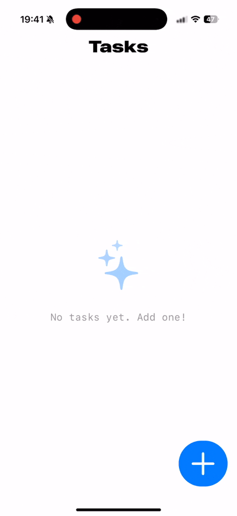
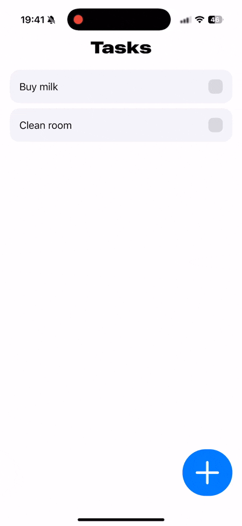

# To Do List application

A lightweight iOS demo application using:
- SwiftUI
- Core Data
- Clean architecture with VIPER-inspired layers
- MVVM for View + ViewModel logic separation
- Unit and UI testing with XCTest

## 📱 Features

<table> 
  <tr> 
    <td align="center"><strong>Light / Dark Mode</strong></td> 
    <td align="center"><strong>Animated TextField</strong></td> 
    <td align="center"><strong>Adding Tasks</strong></td> 
  </tr> 
  <tr> 
    <td></td> 
    <td></td> 
    <td></td> 
  </tr> 
  <tr> 
    <td align="center"><strong>Completing Tasks</strong></td> 
    <td align="center"><strong>Deleting Tasks</strong></td> 
  </tr> 
  <tr> 
    <td></td> 
    <td></td> 
  </tr> 
</table>

- Persist data locally with Core Data
- VIPER-like modularisation (View, Interactor, Presenter/ViewModel, Entity, Repository)
- XCTest-based unit and UI test coverage

## 🚀 Getting Started

1. Clone the repo
2. Open in Xcode
3. Run on simulator or device

## 💡 Why This App

This is a minimal yet production-ready app that showcases my ability to:

- Architect with modular, testable components
- Persist data with Core Data
- Write clean and scalable SwiftUI code
- Implement and maintain both unit and UI tests using XCTest
